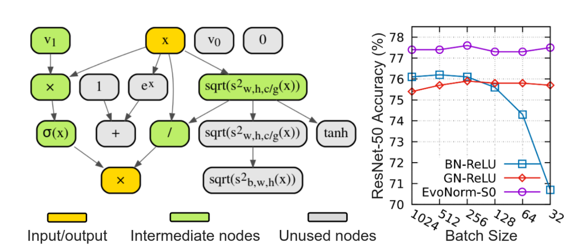

# Evolving Normalization-Activation Layers

<em>Figure 1. Left: Computation graph of a searched normalization activation layer that is batch-independent, named EvoNorm-S0.      Right: ResNet-50 results with EvoNorm-S0 as the batch size over 8 workers varies from 1024 to 32 on ImageNet. EvoNorm-S0 also outperforms both BN and GN-based layers on MobileNetV2 and Mask R-CNN.
</em>

